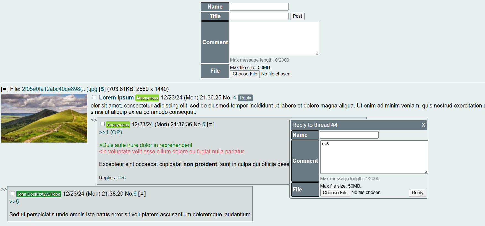

# PyChan - Imageboard Engine made with Python

## Features
- Simple markdown: bold (**), italic (*) and underline (__)
- Green (>) and Pink (<) text
- Quick replies
- Reply previews
- Closing/pinning threads
- Mod and Admin functions
- Youtube embeds
- Captcha
- Mobile responsive design (through CSS media queries)
- Tripcodes (secured, and non-secured)
- Mods are able to see poster's IP
- Sage

## TODO:
- Threads archieve
- Roles: Janitor, Moderator, Administrator
- Thread searching
- Oekaki (drawing in browser)
- API
- Interface management
- Live threads update
- Janitors/Mods actions logging
- More text formatting
- Capcodes
- Dice rolling

## Guide
1. Clone the repository and access the folder:

`$ git clone https://github.com/VariableIsUndefined/PyChan-engine.git`

`$ cd PyChan-engine`

2. Get the dependencies

`$ pip install -r requirements.txt`

3. Rename or copy the default configuration file, modify it to your liking

`$ cp default.conf imageboard.conf`

4. Run the app

`$ python backend.py`

Admin dashboard is at `/admin` for which you'll first have to go through `/login`.

## Notes
- The functions to limit the size of uploads and reverse proxy only work in production mode.
- To use a MySQL database install pymysql, and psycopg2 for Postgresql.
