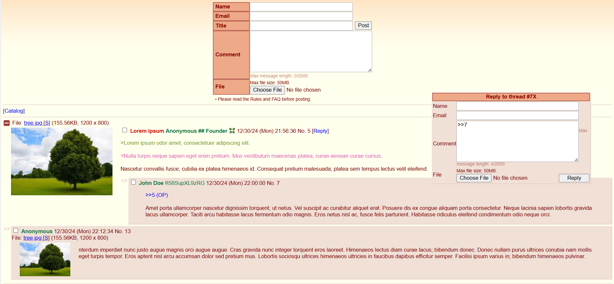

# 🌸 Hinaba - Next-Gen Imageboard Engine 
  
  
  

### 🚀 Features  
Hinaba is a powerful and flexible imageboard engine written in Python, packed with modern features:  

- **Categories and Boards**: Create custom categories for boards.  
- **Markdown Support**: Includes bold (**), italic (*), underline (__), spoilers (%%), and inline code (`).  
- **Color-coded Text**: Green (>) and pink (<).  
- **Quick Replies and Message Previews**.  
- **Moderation Tools**: Close/pin threads, administrative functions.  
- **Mobile Design**: Fully responsive with CSS media queries.  
- **Tripcodes and Capcodes**: Support for both secure and non-secure tripcodes, as well as capcodes for moderators and admins.  
- **Captcha Integration**: Helps prevent spam.  
- **Limits**: Upload size restrictions, thread limits, and message size caps.  
- **YouTube Embeds and Dice Rolls**.
- **Banners for boards**: Create and archive banners for boards.
### 🛠️ TODO  
Planned features:  

- Thread archiving.  
- Role system: Janitor, Moderator, Administrator.  
- API and live thread updates.  
- Oekaki (drawing in the browser).  
- Moderator action logging.  
- Individual board settings: bump limits, file size caps, message length, rules, etc.  

### ⚠️ Warning  
**The current repository version might be unstable.**  
It is highly recommended to use the latest release instead.  

### 🧑‍💻 Installation  

1. Clone the repository and navigate to the folder:  

`$ git clone https://github.com/VariableIsUndefined/Hinaba-engine.git`

`$ cd Hinaba-engine`

2. Get the dependencies

`$ pip install -r requirements.txt`

3. Rename or copy the default configuration file, modify it to your liking

`$ cp default.conf imageboard.conf`

4. Run the app

`$ python backend.py`

Admin dashboard is at `/admin` for which you'll first have to go through `/login`.

### 📚 Notes
- To use a MySQL database install ```pymysql```, and ```psycopg2``` for Postgresql.
- Upload size limits and reverse proxy settings work only in production mode.
